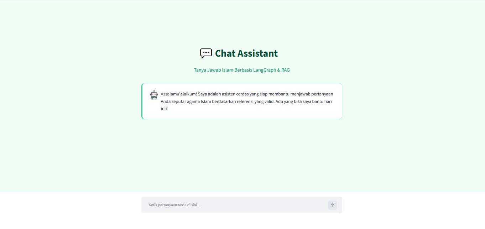
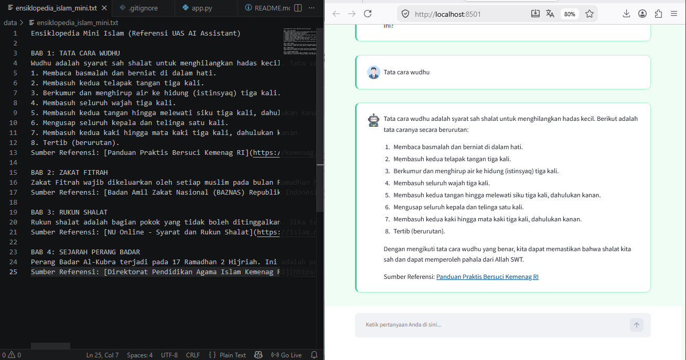
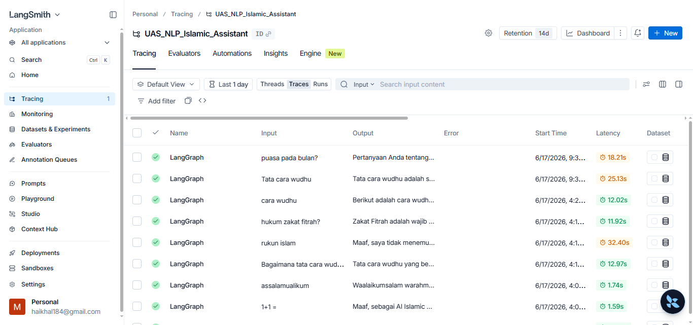

🕌 AI Islamic Assistant

AI Islamic Assistant adalah sistem tanya jawab cerdas berbasis Retrieval-Augmented Generation (RAG) dan Agentic Workflow. Aplikasi ini dirancang untuk menjawab pertanyaan seputar hukum (Fiqih), sejarah Islam, dan pengetahuan agama lainnya secara akurat dengan merujuk langsung pada dokumen referensi lokal, guna menghindari halusinasi kecerdasan buatan.

Proyek ini dikembangkan sebagai pemenuhan tugas Ujian Akhir Semester (UAS) Natural Language Processing (NLP) di Universitas Islam Riau (UIR).

✨ Fitur Utama

🧠 RAG Pipeline: Mengekstraksi konteks yang relevan dari dokumen lokal (PDF/TXT) sebelum menghasilkan jawaban.

⚡ Agentic Workflow: Dibangun menggunakan LangGraph untuk mengelola state percakapan dan routing logika secara dinamis.

🚀 Cloud LLM Integration: Menggunakan model Llama-3.1-8b-instant via Groq API untuk inferensi secepat kilat.

🔍 Local Embeddings (Multilingual): Menjalankan model paraphrase-multilingual-MiniLM-L12-v2 dari Hugging Face sepenuhnya di mesin lokal, dioptimalkan untuk Bahasa Indonesia.

🎨 Premium UI/UX: Antarmuka responsif dan modern bergaya SaaS menggunakan Streamlit, mengusung tema Emerald Green.

📈 Observability: Terintegrasi penuh dengan LangSmith untuk pelacakan (tracing) metrik performa dan debugging AI di backend.

📸 Tampilan Aplikasi

Berikut adalah dokumentasi visual dari AI Islamic Assistant saat dijalankan di mesin lokal:

1. Antarmuka Utama (Chat Assistant)

Tampilan utama aplikasi dengan tema Emerald Green yang bersih dan fokus pada percakapan. 

2. Bukti Fitur RAG (Retrieval-Augmented Generation)

AI menarik potongan teks asli dari dokumen PDF/TXT lokal untuk menjawab pertanyaan spesifik, menjamin akurasi jawaban. 

3. Tracing Backend via LangSmith

Pelacakan (tracing) alur sistem menggunakan LangSmith untuk memastikan setiap node pada LangGraph berjalan sesuai logika. 

🛠️ Arsitektur & Tech Stack

Bahasa Utama: Python (Wajib v3.10 atau v3.11)

Frontend: Streamlit

AI Orchestration: LangChain & LangGraph

Vector Database: ChromaDB

Embeddings: HuggingFace (sentence-transformers)

LLM Provider: Groq

📂 Struktur Direktori

ai-islamic-assistant/
├── assets/                    # Folder gambar dokumentasi untuk README
│   ├── ss_langsmith.png
│   ├── ss_main_chat.png
│   └── ss_rag_reference.png
├── data/                      # Folder sumber pengetahuan lokal
│   └── ensiklopedia_islam_mini.txt
├── src/                       # Folder modul inti (Backend)
│   ├── __init__.py
│   ├── config.py              # Konfigurasi variabel dan path direktori
│   ├── data_ingestion.py      # Skrip pemrosesan teks ke dalam Vector DB
│   ├── retriever.py           # Logika pencarian dokumen untuk RAG
│   └── workflow.py            # Konfigurasi Node dan Edge pada LangGraph
├── vector_store/              # Folder penyimpanan database lokal (ChromaDB)
├── .env                       # File rahasia kredensial API Keys
├── .gitignore                 # Daftar file/folder yang diabaikan oleh Git
├── app.py                     # Skrip antarmuka UI utama (Streamlit)
├── cli.py                     # Skrip antarmuka Command Line (Terminal)
├── README.md                  # Dokumentasi proyek
└── requirements.txt           # Daftar pustaka dependencies proyek

⚙️ Cara Instalasi & Menjalankan Program (Di Komputer Baru)

Karena alasan keamanan dan efisiensi penyimpanan, file kredensial (.env) dan database lokal (vector_store/) tidak ikut diunggah ke GitHub. Oleh karena itu, ikuti langkah-langkah wajib berikut dari awal.

🚨 PERINGATAN KRUSIAL (Versi Python)

SANGAT DISARANKAN menggunakan Python 3.10 atau Python 3.11.

Jangan menggunakan versi terbaru (seperti Python 3.13 atau 3.14). Pustaka Machine Learning (seperti torch dan transformers) belum memiliki modul pre-compiled untuk versi tersebut. Menggunakan versi terbaru akan menyebabkan error linker link.exe not found di Windows.

1. Unduh Kode Proyek (Download)

Ketik perintah berikut di terminal Anda untuk meng-clone repositori:

git clone [https://github.com/haikhal184/ai-islamic-assistant.git](https://github.com/USERNAME_GITHUB_KAMU/ai-islamic-assistant.git)
cd ai-islamic-assistant

2. Buat & Aktifkan Virtual Environment

Untuk menghindari bentrok antar-pustaka Python di PC Anda, ketik perintah ini di terminal:

python -m venv env

# Untuk mengaktifkan di Windows:
env\Scripts\activate

# Untuk mengaktifkan di Mac/Linux:
source env/bin/activate

(Pastikan muncul tulisan (env) di awal baris terminal).

3. Instalasi Dependencies (Pustaka AI)

Pastikan Anda menggunakan versi yang stabil dengan perintah berikut:

pip install "transformers>=4.40.0,<5.0.0" "sentence-transformers>=3.0.0" "torch>=2.2.0" langchain-community langchain-huggingface langchain-groq chromadb python-dotenv langgraph streamlit

4. Setup File Kredensial (.env)

Buat file baru bernama .env di folder utama (sejajar dengan app.py). Masukkan API Keys Anda:

GROQ_API_KEY="masukkan_groq_api_key_anda_di_sini"
LANGCHAIN_TRACING_V2="true"
LANGCHAIN_ENDPOINT="[https://api.smith.langchain.com](https://api.smith.langchain.com)"
LANGCHAIN_API_KEY="masukkan_langchain_api_key_anda_di_sini"
LANGCHAIN_PROJECT="UAS_NLP_Islamic_Assistant"

5. Membangun Vector Database (Data Ingestion)

Jalankan skrip pembacaan data untuk memuat teks korpus lokal ke dalam database vektor:

python src/data_ingestion.py

(Tunggu hingga terminal menampilkan pesan ✅ PROSES INGESTI SELESAI DENGAN SUKSES!. Proses ini akan mengunduh model embedding Hugging Face Multilingual).

6. Jalankan Aplikasi Web

Setelah database siap, luncurkan antarmuka aplikasi dengan perintah:

python -m streamlit run app.py

🛠️ TROUBLESHOOTING (Solusi Error di Windows)

Jika Anda menemui masalah saat menjalankan program di sistem operasi Windows, berikut adalah solusi untuk error yang paling umum terjadi:

1. Terminal Tiba-Tiba Berhenti / Force Close (Silent Crash)

Gejala: Saat menjalankan python src/data_ingestion.py, program mati mendadak sebelum selesai tanpa memunculkan pesan error merah.

Penyebab: Konflik memori antara PyTorch, OpenMP, dan arsitektur CPU Windows.

Solusi: Program ini sudah disuntikkan proteksi di baris awal kodenya (os.environ["KMP_DUPLICATE_LIB_OK"] = "TRUE"). Jika masih terjadi, hapus folder __pycache__ dan vector_store, lalu jalankan ulang ingesti data.

2. Error "Failed building wheel for tokenizers" / "link.exe not found"

Gejala: Gagal saat melakukan pip install.

Penyebab: Anda menggunakan versi Python yang terlalu baru (misal: Python 3.14) sehingga sistem menuntut C++ Compiler dari Visual Studio.

Solusi: Downgrade (turunkan) versi Python Anda ke Python 3.11. Hapus folder env lama, buat env baru menggunakan Python 3.11, lalu lakukan pip install kembali.

🎓 Identitas Proyek

Aplikasi ini dikembangkan untuk keperluan akademis:

Mata Kuliah: Natural Language Processing (NLP)

Program Studi: Teknik Informatika

Universitas: Universitas Islam Riau (UIR)

Semester: 6

NPM: 233510516